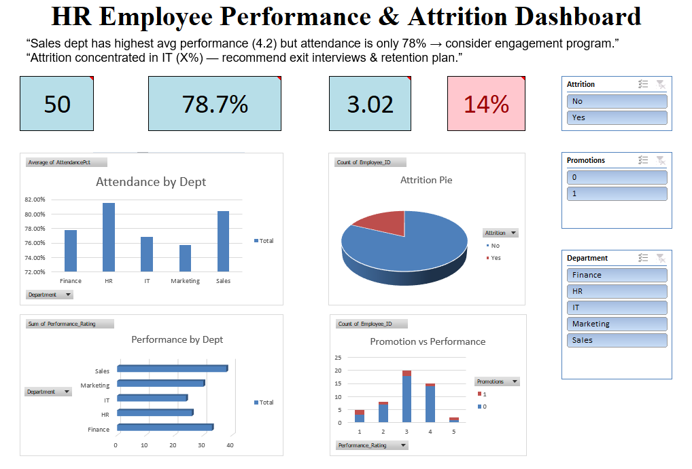

# HR Employee Performance Analysis (Excel)

## Project Overview
This Excel-based project analyzes employee performance and HR metrics to help organizations understand workforce productivity, performance trends, and key improvement areas.

## Objectives
- Analyze employee performance ratings
- Identify high-performing and low-performing employees
- Study department-wise performance trends
- Evaluate impact of experience and training on performance

## Tools Used
- Microsoft Excel
- Pivot Tables
- Pivot Charts
- Conditional Formatting
- Excel Dashboards

## Project Structure
- **Excel** → Project workbook  
- **Images** → Dashboard screenshot 
 

## Key Analysis Performed
- Department-wise performance comparison
- Employee performance distribution
- Experience vs performance analysis
- KPI-based performance evaluation

## Dashboard Preview

## How to Use
1. Download the Excel file
2. Open in Microsoft Excel
3. Explore Pivot Tables and Dashboard sheets
4. Use slicers/filters for interactive analysis

## Author
Shruti Khadtar
